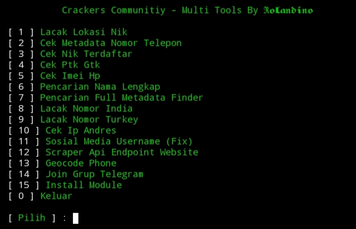

# Crackers Community – Multi Tools

Multi Tools Gratis Yang Dibuat Khusus Untuk Kebutuhan Investigasi Data Digital, Analisis Identitas, Scraping Informasi, Dan Tracking Berbasis Api, Tools Ini **FREE**, Aman Dipakai, Dan Bisa Langsung Dijalankan Tanpa Konfigurasi Rumit Cukup Download Melalui Link Resmi Yang Disediakan

---

**LINK DOWNLOAD SCRIPT :**  
*Tulis link download di sini*

---

**Cara Pemakaian**

1. Jalankan Script

2. Pilih Menu Fitur Sesuai Dengan Menu

4. Hasil Langsung Tampil Di Layar

**Script Ini Berjalan Cepat Karena Menggunakan Kombinasi**

Scraping HTML

API Endepoint 

Database Pattern Matching

HLR Lookup

Geo Decoding

---

**Keunggulan Multi Tools Ini**

Tidak Butuh API Key berbayar

Hasil Cepat Dan Responsif

Fitur OSINT Lengkap Dalam Satu Script

Tampilan Rapi Dan Mudah Digunakan

Auto Install Dependencies

Cocok Untuk Investigasi Data Dan Digital Forensics Ringan

---

**Teknologi Yang Digunakan**

Python (requests, json, bs4, re)

Web Scraping

API Endpoint Validation

HLR / Metadata Checker

IP Geolocation Database

Multi-Region Phone Lookup

---

**Bergabung Dengan Crackers Community**

Dapatkan Update Tools Terbaru, Script Premium, Dan Diskusi Program Script 

Channel Telegram: Tulis link di sini

Grup Telegram: Tulis link di sini

---

**Disclaimer**

Tools Ini Dibuat Untuk

Pembelajaran

Penelitian

Digital Investigation

Pentesting

DILARANG Keras Digunakan Untuk Tindakan Ilegal, Segala Bentuk Penyalahgunaan Adalah Tanggung Jawab Pengguna, Bukan Developer!

---
